# Database Documentation

## Overview
The AI4Devs Recruitment System uses PostgreSQL as its primary database, with Prisma as the ORM. This document details the database schema, relationships, and data models.

## Schema Design

### Entity Relationship Diagram

```mermaid
erDiagram
    Candidate {
        int id PK
        string firstName
        string lastName
        string email
        string phone
        string address
    }

    Education {
        int id PK
        string institution
        string title
        datetime startDate
        datetime endDate
        int candidateId FK
    }

    WorkExperience {
        int id PK
        string company
        string position
        string description
        datetime startDate
        datetime endDate
        int candidateId FK
    }

    Resume {
        int id PK
        string filePath
        string fileType
        datetime uploadDate
        int candidateId FK
    }

    Company {
        int id PK
        string name
    }

    Employee {
        int id PK
        int companyId FK
        string name
        string email
        string role
        boolean isActive
    }

    InterviewType {
        int id PK
        string name
        string description
    }

    InterviewFlow {
        int id PK
        string description
    }

    InterviewStep {
        int id PK
        int interviewFlowId FK
        int interviewTypeId FK
        string name
        int orderIndex
    }

    Position {
        int id PK
        int companyId FK
        int interviewFlowId FK
        string title
        string description
        string status
        boolean isVisible
        string location
        string jobDescription
        string requirements
        string responsibilities
        float salaryMin
        float salaryMax
        string employmentType
        string benefits
        string companyDescription
        datetime applicationDeadline
        string contactInfo
    }

    Application {
        int id PK
        int positionId FK
        int candidateId FK
        datetime applicationDate
        int currentInterviewStep FK
        string notes
    }

    Interview {
        int id PK
        int applicationId FK
        int interviewStepId FK
        int employeeId FK
        datetime interviewDate
        string result
        float score
        string notes
    }
```


## Data Models

### Candidate
```typescript
model Candidate {
  id              Int              @id @default(autoincrement())
  firstName       String
  lastName        String
  email           String          @unique
  phone           String?
  address         String?
  educations      Education[]
  workExperiences WorkExperience[]
  resumes         Resume[]
  applications    Application[]
}
```

### Education
```typescript
model Education {
  id          Int       @id @default(autoincrement())
  institution String
  title       String
  startDate   DateTime
  endDate     DateTime?
  candidate   Candidate @relation(fields: [candidateId], references: [id])
  candidateId Int
}
```

### WorkExperience
```typescript
model WorkExperience {
  id          Int       @id @default(autoincrement())
  company     String
  position    String
  description String?
  startDate   DateTime
  endDate     DateTime?
  candidate   Candidate @relation(fields: [candidateId], references: [id])
  candidateId Int
}
```

### Resume
```typescript
model Resume {
  id          Int       @id @default(autoincrement())
  filePath    String
  fileType    String
  uploadDate  DateTime  @default(now())
  candidate   Candidate @relation(fields: [candidateId], references: [id])
  candidateId Int
}
```

### Company
```typescript
model Company {
  id        Int        @id @default(autoincrement())
  name      String     @unique
  employees Employee[]
  positions Position[]
}
```

### Employee
```typescript
model Employee {
  id        Int        @id @default(autoincrement())
  company   Company    @relation(fields: [companyId], references: [id])
  companyId Int
  name      String
  email     String     @unique
  role      String
  isActive  Boolean    @default(true)
  interviews Interview[]
}
```

### InterviewType
```typescript
model InterviewType {
  id          Int            @id @default(autoincrement())
  name        String
  description String?
  steps       InterviewStep[]
}
```

### InterviewFlow
```typescript
model InterviewFlow {
  id          Int            @id @default(autoincrement())
  description String?
  steps       InterviewStep[]
  positions   Position[]
}
```

### InterviewStep
```typescript
model InterviewStep {
  id              Int         @id @default(autoincrement())
  interviewFlow   InterviewFlow @relation(fields: [interviewFlowId], references: [id])
  interviewFlowId Int
  interviewType   InterviewType @relation(fields: [interviewTypeId], references: [id])
  interviewTypeId Int
  name            String
  orderIndex      Int
  applications    Application[]
  interviews      Interview[]
}
```

### Position
```typescript
model Position {
  id                  Int         @id @default(autoincrement())
  company            Company     @relation(fields: [companyId], references: [id])
  companyId          Int
  interviewFlow      InterviewFlow @relation(fields: [interviewFlowId], references: [id])
  interviewFlowId    Int
  title              String
  description        String?
  status             String      @default("Draft")
  isVisible          Boolean     @default(false)
  location           String?
  jobDescription     String?
  requirements       String?
  responsibilities   String?
  salaryMin          Float?
  salaryMax          Float?
  employmentType     String?
  benefits           String?
  companyDescription String?
  applicationDeadline DateTime?
  contactInfo        String?
  applications       Application[]
}
```

### Application
```typescript
model Application {
  id                   Int         @id @default(autoincrement())
  position            Position    @relation(fields: [positionId], references: [id])
  positionId          Int
  candidate           Candidate   @relation(fields: [candidateId], references: [id])
  candidateId         Int
  applicationDate     DateTime    @default(now())
  currentInterviewStep InterviewStep? @relation(fields: [currentInterviewStepId], references: [id])
  currentInterviewStepId Int?
  notes               String?
  interviews          Interview[]
}
```

### Interview
```typescript
model Interview {
  id             Int           @id @default(autoincrement())
  application    Application   @relation(fields: [applicationId], references: [id])
  applicationId  Int
  interviewStep  InterviewStep @relation(fields: [interviewStepId], references: [id])
  interviewStepId Int
  employee       Employee      @relation(fields: [employeeId], references: [id])
  employeeId     Int
  interviewDate  DateTime
  result         String?
  score          Float?
  notes          String?
}
```

## Indexes

### Primary Indexes
- All tables have an auto-incrementing `id` field as primary key

### Unique Indexes
- Candidate.email
- Company.name
- Employee.email

### Foreign Key Indexes
- Education.candidateId
- WorkExperience.candidateId
- Resume.candidateId
- Employee.companyId
- InterviewStep.interviewFlowId
- InterviewStep.interviewTypeId
- Position.companyId
- Position.interviewFlowId
- Application.positionId
- Application.candidateId
- Application.currentInterviewStepId
- Interview.applicationId
- Interview.interviewStepId
- Interview.employeeId

## Migrations
Database migrations are managed using Prisma Migrate. To create a new migration:

```bash
npx prisma migrate dev --name <migration-name>
```

To apply migrations in production:

```bash
npx prisma migrate deploy
```

## Data Validation
- Email addresses must be unique and valid
- Phone numbers must follow international format
- Dates must be valid and logical (end dates after start dates)
- File types for resumes must be allowed types
- Salary ranges must be logical (min <= max)

## Backup Strategy
- Daily automated backups
- Point-in-time recovery
- Backup retention for 30 days

## Performance Optimization
- Indexed foreign keys
- Optimized query patterns
- Connection pooling
- Query caching where appropriate 